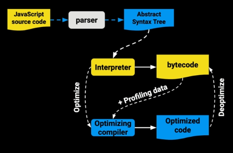
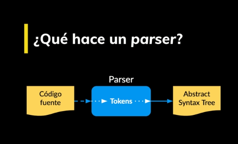
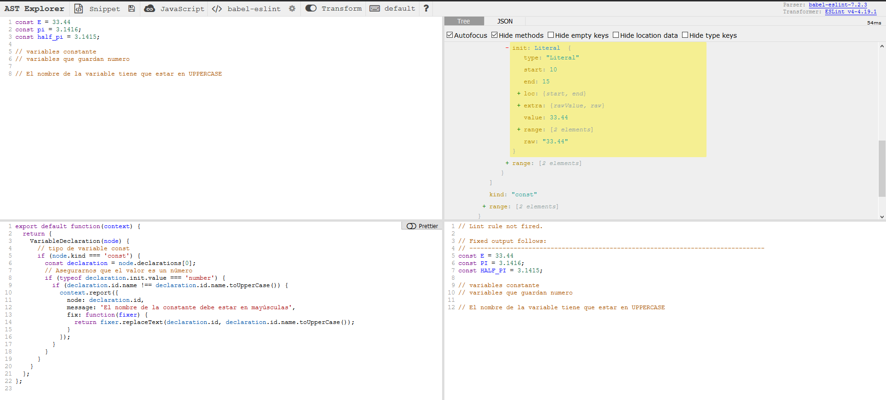
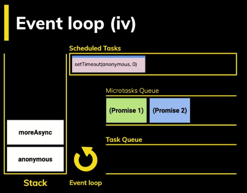

# CURSO PROFESIONAL DE JAVASCRIPT

## INTRODUCCIÓN

### ¿Qué significa ser un profesional de JavaScript?

Richard Kaufman trabaja para KickAss Partners como Senior Front End Engineer y es organizador de la comunidad de Javascript en Ciudad De México. Richard será tu profesor en este curso, él te va a enseñar Javascript puro, repasando los fundamentos clave del lenguaje, explorando APIs del DOM, implementando TypeScript y aplicando las mejores prácticas con Patrones de Diseño.

Vamos a necesitar:

- Editor de textos Visual Studio Code.
- Navegador Web Google Chrome.
- Una CLI (terminal de linea de comandos)…

Es recomendable tener conocimientos en:

- HTML
- CSS
- Básicos de Javascript

En la pestaña de Archivos y Enlaces encontrarás todos los cursos necesarios que forman parte de la EscuelaJS.

En este curso es el primer paso para convertirte en un profesional de Javascript que cumple con lo siguiente:

- Conocimiento profundo del lenguaje, conocer sus particularidades y cómo funciona internamente.
- Conocer los entornos de programación para Javascript.
- Siempre aplicar las mejores prácticas.
- Ser versado en código, leer código de otras personas.
- Tener un set de herramientas que dominas.
- Ética / Profesionalismo
- Experiencia.

Y recuerda que puedes encontrar a tu profesor en twitter como @sparragus.

### Inicio del proyecto

Trabajaremos en el proyecto PlatziVideo, una plataforma de vídeo.

Esta es la base de nuestro proyecto y nos vamos a enfocar en el MediaPlayer. Durante el curso se desarrollarán plugins de forma modular para extender la funcionalidad del MediaPlayer.

El repositorio de este curso lo encuentras en: https://github.com/platzi/javascript-profesional.

## REPASO CONCEPTOS FUNDAMENTALES

### Cómo llega un script al navegador

El **DOM **es la representación que hace el navegador de un documento HTML.

El navegador interpreta el archivo HTML y cuando termina de transformarlo al DOM se dispara el evento DOMContentLoaded lo que significa que todo el documento está disponible para ser manipulado.

Todo script que carguemos en nuestra página tiene un llamado y una ejecución.

Tanto con async como defer podemos hacer llamados asíncronos pero tiene sus diferencias:

- async. Con async podemos hacer la petición de forma asíncrona y no vamos a detener la carga del DOM hasta que se haga la ejecución del código.
- defer. La petición es igual asíncrona como en el async pero va a deferir la ejecución del Javascript hasta el final de que se cargue todo el documento.

Hay que tener en cuenta que cuando carga una página y se encuentra un script a ejecutar toda la carga se detiene. Por eso se recomienda agregar tus scripts justo antes de cerrar el body para que todo el documento esté disponible.

### Scope

El Scope o ámbito es lo que define el tiempo de vida de una variable, en que partes de nuestro código pueden ser usadas.

- Global Scope:

Variables disponibles de forma global se usa la palabra var, son accesibles por todos los scripts que se cargan en la página. Aquí hay mucho riesgo de sobreescritura.

- Function Scope:

Variables declaradas dentro de una función sólo visibles dentro de ella misma (incluyendo los argumentos que se pasan a la función).

- Block Scope

Variables definidas dentro de un bloque, por ejemplo variables declaradas dentro un loop while o for. Se usa let y const para declarar este tipo de variables.

- Module Scope

Cuando se denota un script de tipo module con el atributo type="module las variables son limitadas al archivo en el que están declaradas.

### Closures

Son funciones que regresan una función o un objeto con funciones que mantienen las variables que fueron declaradas fuera de su scope.

Los closures nos sirven para tener algo parecido a variables privadas, característica que no tiene JavaScript por default. Es decir encapsulan variables que no pueden ser modificadas directamente por otros objetos, sólo por funciones pertenecientes al mismo.

### this

this se refiere a un objeto, ese objeto es el que actualmente está ejecutando un pedazo de código.

No se puede asignar un valor a this directamente y este depende de en que scope nos encontramos:

- Cuando llamamos a this en el Global Scope o Function Scope, se hace referencia al objeto window. A excepción de cuando estamos en strict mode que nos regresará undefined.
- Cuando llamamos a this desde una función que está contenida en un objeto, this se hace referencia a ese objeto.
- Cuando llamamos a this desde una “clase”, se hace referencia a la instancia generada por el constructor.

### Los métodos call, apply y bind

Estas funciones nos sirven para establecer el valor de this, es decir cambiar el contexto que se va usar cuando la función sea llamada.

Las funciones call, apply y bind son parte del prototipo Function. Toda función usa este prototipo y por lo tanto tiene estas tres funciones.

- functionName.call(). Ejecuta la función recibiendo como primer argumento el this y los siguientes son los argumentos que recibe la función que llamó a call.
- functionName.apply(). Ejecuta la función recibiendo como primer argumento el this y como segundo un arreglo con los argumentos que recibe la función que llamó a apply.
- functionName.bind(). Recibe como primer y único argumento el this. No ejecuta la función, sólo regresa otra función con el nuevo this integrado.

### Prototype

En Javascript todo son objetos, no tenemos clases, no tenemos ese plano para crear objetos.

Todos los objetos “heredan” de un prototipo que a su vez hereda de otro prototipo y así sucesivamente creando lo que se llama la **prototype chain**.

La keyword **new** crea un nuevo objeto que “hereda” todas las propiedades del prototype de otro objeto. No confundir __prototype__ con __proto__ que es sólo una propiedad en cada instancía que apunta al prototipo del que hereda.

### Herencia Prototipal

Por default los objetos en JavaScript tienen cómo prototipo a **Object** que es el punto de partida de todos los objetos, es el prototipo padre. Object es la raíz de todo, por lo tanto tiene un prototipo padre undefined.

Cuando se llama a una función o variable que no se encuentra en el mismo objeto que la llamó, se busca en toda la prototype chain hasta encontrarla o regresar undefined.

La función **hasOwnProperty** sirve para verificar si una propiedad es parte del objeto o si viene heredada desde su prototype chain.

## ¿CÓMO FUNCIONA JAVASCRIPT?

### Parsers y el Abstract Syntax Tree

- ¿Qué hace un JS Engine?

1. Recibe un código fuente.
2. Parsea el código y produce un Abstract Syntax Tree (AST).
3. Se compila a bytecode y se ejecuta.
4. Se optimiza a machine code y se reemplaza el código base.



¿Qué hace un parser?



Un **SyntaxError** es lanzado cuando el motor de JavaScript se encuentra con partes de código que o forman parte de la sintaxis del lenguaje al momento de analizar el código.

- Google dice:

1. Parsing es 15-20% del proceso de ejecución.
2. La mayoría de JavaScript en una página nunca se ejecuta.
3. Esto hace que **building y code splitting** sea muy importante.

- Parser de VO:


¿Qué es el AST (Abstract Syntax Tree)

Es un grafo (estructura de datos) que representa un programa.

Se usa en:

- JavaScript Engine.
- Bundlers: Webpack, Rollup, Parcel.
- Transpilers: Babel.
- Linters: ESLint, Prettify.
- Type Checkers: TypeScript, Flow.
- Syntax Highlighters.

El JS Engine recibe el código fuente y lo procesa de la siguiente manera:

1. El parser descompone y crea tokens que integran el AST.
2. Se compila a bytecode y se ejecuta.
3. Lo que se pueda se optimiza a machine code y se reemplaza el código base.

Un SyntaxError es lanzado cuando el motor JavaScript encuentra partes que no forman parte de la sintaxis del lenguaje y esto lo logra gracias a que se tiene un AST generado por el parser.

El parser es del 15% al 20% del proceso de ejecución por lo que hay que usar parser del código justo en el momento que lo necesitamos y no antes de saber si se va a usar o no.

### Práctica AST



```javascript
export default function(context) {
  return {
    VariableDeclaration(node) {
      // tipo de variable const
      if (node.kind === 'const') {
        const declaration = node.declarations[0];
        // Asegurarnos que el valor es un número
        if (typeof declaration.init.value === 'number') {
          if (declaration.id.name !== declaration.id.name.toUpperCase()) {
            context.report({
              node: declaration.id,
              message: 'El nombre de la constante debe estar en mayúsculas',
              fix: function(fixer) {
                return fixer.replaceText(declaration.id, declaration.id.name.toUpperCase());
              }
            });
          }
        }
      }
    }
  };
};

```

### Cómo funciona el JavaScript Engine

Una vez tenemos el **AST** ahora hay que convertirlo a Bytecode.

**Bytecode** es como el código assembler pero en lugar de operar en el procesador opera en la máquina virtual **V8** del navegador.

Machine code es el más bajo nivel, es código binario que va directo al procesador.

El **profiler** se sitúa en medio del bytecode y el optimizador

Cada máquina virtual tiene sus particularidades, por ejemplo V8 tiene algo llamado Hot Functions.

Cuando una sentencia función es ejecutada muy frecuentemente, V8 la denomina como una hot function y hace una optimización que consiste en convertirla a machine code para no tener que interpretarla de nuevo y agilizar su ejecución.

Cada navegador tiene su implementación de JavaScript Engine:

- SpiderMonkey - Firefox: 2 capas de optimizacipon.
- Chackra - Edge: 2 capas de optimización.
- JavaScriptCore - Safari: 3 capas de optimización.
- V8 - Chrome

¿Qué hace el JS Engine?

1. Recibe código fuente.
2. Parsea el código y produce un AST (Abstract Syntax Tree).
3. Se compila a bytecode y se ejecuta.
4. Se optimiza el machine code y se reemplaza el código base.

| Bytecode                         | Machine Code                                            |
|----------------------------------|---------------------------------------------------------|
| Código parecido a assembly       | Binario                                                 |
| Portatil                         | Instruccioes specíficas a una arquitectura o procesador |
| Ejecutado por una virtua machine |                                                         |

### Event Loop

El **Event Loop** hace que Javascript parezca ser **multihilo** a pesar de que corre en un solo proceso.

Javascript se organiza usando las siguientes estructuras de datos:

- Stack. Va apilando de forma organizada las diferentes instrucciones que se llaman. Lleva así un rastro de dónde está el programa, en que punto de ejecución nos encontramos.
- Memory Heap. De forma desorganizada se guarda información de las variables y del scope.
- Schedule Tasks. Aquí se agregan a la cola, las tareas programadas para su ejecución.
- Task Queue. Aquí se agregan las tareas que ya están listas para pasar al stack y ser ejecutadas. El stack debe estar vacío para que esto suceda.
- MicroTask Queue. Aquí se agregan las promesas. Esta Queue es la que tiene mayor prioridad.

El Event Loop es un loop que está ejecutando todo el tiempo y pasa periódicamente revisando las queues y el stack moviendo tareas entre estas dos estructuras.



## FUNSAMENTOS INTERMEDIOS

### Promesas

Para crear las promesas usamos la clase Promise. El constructor de Promise recibe un sólo argumento, un callback con dos parámetros, resolve y reject. resolve es la función a ejecutar cuando se resuelve y reject cuando se rechaza.

El async/await es sólo syntax sugar de una promesa, por debajo es exactamente lo mismo.

La clase Promise tiene algunos métodos estáticos bastante útiles:

- Promise.all. Da error si una de las promesas es rechazada.
- Promise.race. Regresa sólo la promesa que se resuelva primero.

### Getters y setters

Los getters y setters son funciones que podemos usar en un objeto para tener propiedades virtuales. Se usan los keywords set y get para crear estas propiedades.

Estas propiedades al ser funciones pueden llevar una validación de por medio y ser usadas con el operador de asignación como si fueran una variable más dentro del objeto.

## FUNDAMENTOS AVANZADOS

### Proxy

El proxy sirve para interceptar la lectura de propiedades de un objeto (los get, y set) entre muchas otras funciones. Así, antes de que la llamada llegue al objeto podemos manipularla con una lógica que nosotros definamos.

### Generators

Los generadores son funciones especiales, pueden pausar su ejecución y luego volver al punto donde se quedaron recordando su scope.

Algunas de sus características:

- Los generadores regresan una función.
- Empiezan suspendidos y se tiene que llamar next para que ejecuten.
- Regresan un value y un boolean done que define si ya terminaron.
- __yield__ es la instrucción que regresa un valor cada vez que llamamos a next y detiene la ejecución del generador.

## APIS DEL DOM

### Fetch - Cómo cancelar peticiones

La peticiones AJAX permitieron en su tiempo hacer peticiones asíncronas al servidor sin tener que detener la carga de la página. Hoy en día se utiliza la función **fetch** para esto.

Con **fetch** tenemos algo llamado **AbortController** que nos permite enviar una señal a una petición en plena ejecución para detenerla.

### IntersectionObserver

Sirve para observar elementos y si cruzan un umbral que nosotros definimos nos lo va a notificar para tomar acción.

El umbral se define por el porcentaje que tiene intersección con el viewport, con la parte visible de nuestra página.

### VisibilityChange

El **visibilityChange** forma parte del API del DOM llamado **Page Visibility** y nos deja saber si el elemento es visible, pude ser usado para ejecutar una acción cuando cambiamos de pestaña. Así podemos ahorrar batería y mejorar la UX.

### Service Workers

Sirven para hacer que nuestras aplicaciones funcionen Offline.

Muy usados en las **Progressive Web Apps** (PWA) los ServiceWorkers son una capa que vive entre el navegador y el Internet.

Parecido a como lo hacen los proxys van a interceptar peticiones para guardar el resultado en cache y la próxima vez que se haga la petición tomar del cache ese resultado.

## TYPESCRIPT

### Introducción

**TypeScript** es un superset de JavaScript que añade tipos a nuestras variables ayudando así a la detección de errores de forma temprana y mejorando el autocompletado.

Los navegadores no entienden TypeScript así que lo vamos a transpilar a JavaScript usando Parcel.

### Tipos básicos

Tipos:

- boolean. Valor verdadero o falso.
- number. Números.
- string. Cadenas de texto.
- string[]. Arreglo del tipo cadena de texto.
- Array. Arreglo multi-tipo, acepta cadenas de texto o números.
- enum. Es un tipo especial llamado enumeración.
- any. Cualquier tipo.
- object. Del tipo objeto.

### Funciones

En Typescript podemos ser explícitos con el tipo de los argumentos y el tipo de retorno de una función.

### Interfaces

Nos permiten declarar la forma exacta de un objeto, definiendo los tipos de sus propiedades y si son opcionales o no.

### Clases

En las clases en TypeScript sí existen las propiedades privadas.

## PATRONES DE DISEÑO

### Qué es un patrón de diseño

Son soluciones generales ya probadas dentro de un contexto que las limita a problemas frecuentes que nos encontramos en el desarrollo de software.

- El contexto es la situación donde el patrón aplica.
- Esta situación debe ser recurrente.
- Ejemplo: Muchos objetos están interesados en el estado de otro objeto.

- Se refiere a la meta que estás tratando de alcanzar dentro del contexto.
- El problema incluye todas las limitaciones que existen dentro de este contexto.
- Ejemplo: Estos objetos quieren recibir notificaciones cuando cambie el estado sin tener que solicitar la información.

- Un diseño **genérico** que alcanza a la meta dentro del contexto.
- Ejemplo: Crear una clase donde cualquier objeto se pueda suscribir y descubrir a cambios en el estado.

> El ejemplo dictado corresponde al patrón __observer pattern__.

No corresponden a patrones de diseño:

Every Layour
¿Cómo acomodar elementos?

Media Queries
¿Cómo acomodar la información para diferentes tipos de pantalla?

#### Un poco de historia

La idea de los patrones comienza en la arquitectura con **Christopher Alexander**.

Sus libros describen patrones para construir arquitectura dinámica como casas, pueblos y ciudades.

El libro que comenzó el campo de patrones de diseño de sotware se llama __Design Patterns__, fue publicado en 1995 y describe los patrones fundamentales.

#### Beneficios

- Los patrones de diseño son una caja de herramientas de soluciones bien probadas a problemas comunes en diseño de software.
- Provee un lenguaje común que permite una comunicación específica y eificiente.

#### Crítica

- Los patrones de diseño son una forma de complejidad.
- Son souciones a las limitaciones de un lenguaje de programación. Ejemplo: `Java o C# no tienen funciones de alto nivel`.

### Categorías de patrones de diseño


#### Patrones Creacionales

Provee diferentes mecanismos para crear objetos.

1. Abstract Factory.
2. Builder:

   Es usado para __permitir la creación de una varidad de objetos complejos desde un objeto fuente__.

   Separa la creación de un objeto compejo de su estructura, de tal forma que el mismo proceso de construcción puede servir para crear representaciones diferentes.

3. Factory Method.
4. Prototype.
5. Singleton.

#### Patrones Estructurales

Describen formas de componer objetos para formar nuevas estructuras flexibles y eficientes.

1. Adapter: expone una interfaz externa y esconde una interfaz interna que puede ser compleja.
2. Bridge.
3. Composite.
4. Decorator.
5. Facade.
6. Flyweight.
7. Proxy: intercepta llamadas a objetos para realizar un proceso previo.

#### Patrones de Comportamiento

Gestionan algoritmos y responsabilidades entre objetos.

1. Chain of Responsability.
2. Command.
3. Interpreter.
4. Iterator.
5. Mediator.
6. Memento.
7. Observer: un objeto le pasa el estado interno a muchos objetos que están interesados.
8. State.v
9. Strategy.
10. Template Method.
11. Visitor.

### Patrón Singleton y Casos de Uso

Es un patrón que te asegura que una clase solo tiene una instancia. Esta única instancia puede ser consumida por cualquier otro objeto.


#### Una analogía

El gobierno de tu áís.

Podrán haber varios partidos, pero un sólo gobierno.

Por ejemplo, el __Gobierno de Alpha Centauri__ es un punto de acceso global que identifica un grupo de personas a cargo.

#### Mongoose

Mongoose es una librería que ayuda a interactuar con una base de datos de MongoDB. Provee una interfaz simple para buscar, escribir y validar datos.

En este etipo de librerías sólo se quiere tener una instancia.

### ¿Cómo funciona el Patrón Observer?

En esta clase Richard Kaufman, tu profesor en el Curso profesional de JavaScript, nos explica el funcionamiento del patrón observer y como implementarlo.

El patrón observer se compone de un sujeto que ofrece mecanismos de suscripción y desuscripción a múltiples observadores que quieren ser notificados de los cambios en dicho sujeto. Cada observador expone un método de update que es usado por el sujeto para notificar cualquier cambio a todos los suscritos.

Es uno de los patrones más utilizados, algunos ejemplos típicos son:

- Newsletter.
- Sockets.
- Listeners en páginas web.

### Caso de uso del patrón Observer: Redux

- Librería de manejo de estado.
- Se inicializa un store con un estado y un reducer.
- Se despachan acciones que modifican el estado.
- El store notifica que el estado cambio.

### Patrón Decorator

Añade nuevas responsabilidades a un objeto de forma dinámica permitiendo así extender su funcionalidad sin tener que usar subclases.

#### Decorator

- Añade nuevas responsabilidades a un objeto de forma dinámica.
- Nos permite extender funcionalidad sin tener que usar subclases.

#### Implementación del patrón

